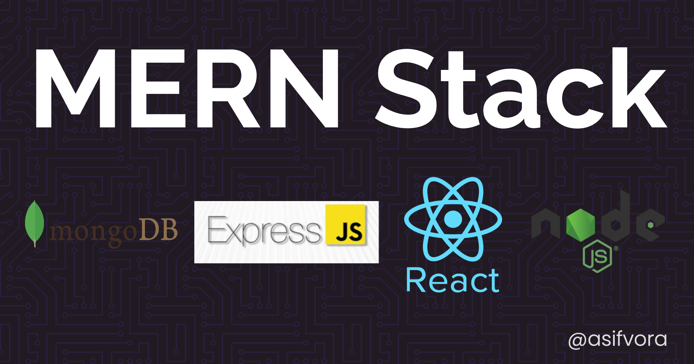

# MERN-Stack

Web app built using MongoDB, ExpressJS, Node.js, and Reactjs (often called as MERN stack).

MongoDB, ExpressJS, Node.js, and Reactjs are used together to build web applications. In this, Node.js and Express bind together to serve the backend, MongoDB provides a NoSQL database to store the data and frontend is built using React that a user interacts with. All four of these technologies are open source, cross-platform and JavaScript based. Since they are JavaScript based, one of the main reasons why they are often used together.

